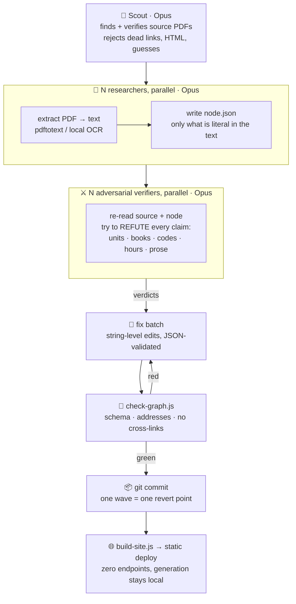

# 🔁 UBA Atlas — an agentic loop you can audit

**A multi-agent pipeline that researches the real Universidad de Buenos Aires,
writes a knowledge graph, and — the hard part — proves it didn't make anything up.**

**Live artifact: [uba-atlas.vercel.app](https://uba-atlas.vercel.app) · 654 nodes ·
8,560 addresses · every one traced to a real document**

The interesting problem is not scraping a university. It is that **LLMs
fabricate**, and at 5,000+ addresses no human can check them. So every wave of
generation runs against a wave of adversarial verification — agents whose only
job is to **refute** what the researchers wrote.

## ⚙️ The loop



**Design choices that make it work:**

- 🚫 **Fail-hard, not fail-soft.** No source → no node. A gap renders as a
  sealed node, honestly. *"A confident render over missing source is a lie
  with good typography."*
- ⚔️ **Verifiers are adversaries, not reviewers.** Prompted to refute, they
  default to suspicion. Researcher and verifier never share context.
- 📜 **Contradictions are recorded, never resolved.** When the source PDF
  contradicts itself (same cover printing two years, two codes), the node
  carries both — resolving would be inventing.
- 🧪 **Deterministic gate before every commit.** `check-graph.js` validates
  graph invariants; a wave only merges green, and each wave is one
  `git revert` away.
- 📬 **Deliberate spend.** Browsing the graph is free; only an explicit job
  enqueues agent work.

## 🎯 What the loop catches (real, from the logs)

| wave | caught by adversarial verification |
|---|---|
| Medicina | a node describing **"siete"** práctico blocks — the source has 4. Pure prose fabrication, refuted line-by-line |
| Lingüística | a **fabricated resolution number** (Res. 2503/2019) — the PDF itself prints 2523/15; plus a virtual-modality decree misattributed as the programa's approval |
| Letras w2 | a bibliography role claiming *obligatoria* where the source says *complementaria*; "tres siglos" where the source spans four; silent spelling "corrections" of the original reverted |
| Clásicas w3 | a selection rule claiming a drawn volume was "the only one" — the verifier found 6 more qualifying volumes and a book the rule demanded but the researcher missed (drawn at wave close) |
| Letras w4 | **the loop refuted its own orchestrator**: a node sealing Filología Latina as "no programa exists" was overturned by an absence-verifier that found 3 real programas in the repository — the node was re-grounded at L2 the same wave |
| Full re-verify | the loop ran retroactively over every node built before it existed: **13 fabrications caught** — invented units with date ranges, a student repo passed off as a cátedra programa, an apunte authored from instructor names, bibliographies harvested from unrelated courses, a chronologically impossible correlativa — every one re-grounded from real sources or removed |
| Letras w5 | a **contradictions register that itself fabricated**: the node's ledger of in-PDF contradictions invented one mention and inverted another — the verifier re-split it from the four real line hits. Plus an off-by-one cascade traced to a single entry skipped after a form-feed |
| Abogacía CPO | all 8 orientation nodes verified by **reproducing every snapshot count exactly** (638 course codes, 1,281 comisiones re-counted from the raw grid) and by diffing all eight orientation blocks across two texto-ordenado editions to prove the one claimed rewrite is the only one |
| Historia w1 | **the loop refuted its own scout — twice.** A node grounded on a 2017 programa claimed "the newest that exists anywhere"; the verifier found the current 2026 programa in a Drive folder the career site's search never indexes, and the node was re-grounded the same wave. Another researcher overturned its own brief the same way (a "stale" materia had three current programas) — and its verifier then corrected the overturn's denominator |
| Historia w1 | a whole **class of false divergences unmasked**: five nodes quoted "literal" cover text containing a pdftotext de-hyphenation artifact (`REDEC-2024-2526UBA…`) — each verifier re-extracted under `-layout` and proved the covers print identical siglas, only line breaks differ |

**60 researchers + 63 verifiers over Letras alone. Verdicts: zero fabricated
units, zero fabricated books, ~130 precision fixes.** Every verdict is committed
in `verification/` — line-referenced refutation reports, one per node — and
`extract/manifest.json` records each source's URL and extraction method.

**And the audit trail ships with the artifact**: every verified node on the
live site carries a *Verificación adversarial* panel (verdict badge, refuted
claims, the verifier's full report), and
[**/audit.html**](https://uba-atlas.vercel.app/audit.html) lists all 271
verdicts — filterable down to the fabrications the loop caught. The output
isn't just data — it's data with an audit trail you can browse.

## 📊 Scale so far

| | |
|---|---|
| faculties at L1 | **13 / 13** — every career, ~2,640 courses verified against official sources |
| Medicina at L2 | **43 / 44** — incl. the 6 rotations of the Internado Anual Rotatorio, from the real per-rotation programa (the 44th is honestly L1: its source publishes no program) |
| Letras at L2 | **62 / 62 — complete** — five full research+verify waves (incl. all of Letras Clásicas) |
| Historia at L2 | **21 / 38** — the whole Ciclo de Grado (9 materias generales + 12 específicas obligatorias); ~3,700 bibliography entries counted both ways across 21 programas |
| Abogacía indexed | CPC + all **8 CPO orientation nodes** drawn literal from the texto ordenado, cross-checked against a live course-offer snapshot |
| honest sealed nodes | **2** (no published source exists — so no node pretends) |
| L2 courses verified | **100%** — every course node in the graph carries an adversarial verdict in `verification/` |
| fabrications shipped | **0** |

## 🛠️ Run it

```bash
node serve.js &          # local navigator + graph on :4137
node watch-queue.js &    # idle watcher: wakes the agent when a job lands
node build-site.js       # render nodes/ → site/ (the whole deploy)
```

Or open the repo in **Claude Code** and say *"run the atlas"* — the machine
ships its own operators as skills: `atlas-grounding` (how to source without
inventing), `atlas-run` (the runbook), `atlas-query` (how to read the data).

The deploy is **only the artifact**: static JSON, rendered. No endpoints, no
online generation.

---

MIT · Deep docs: `CONCEPT.md` · `PROJECT.md` · `PILOT-FINDINGS.md` · `PLAN-SCRAPEO.md`
