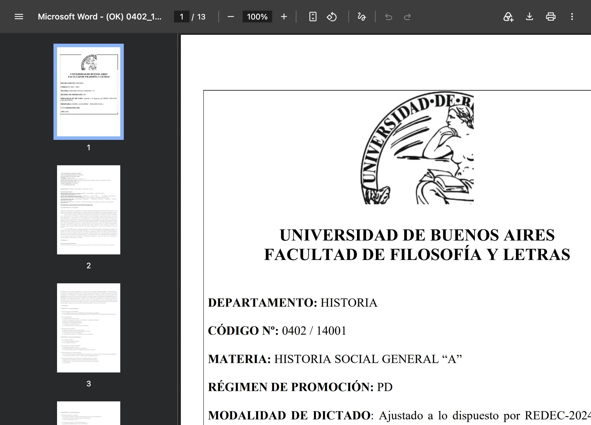
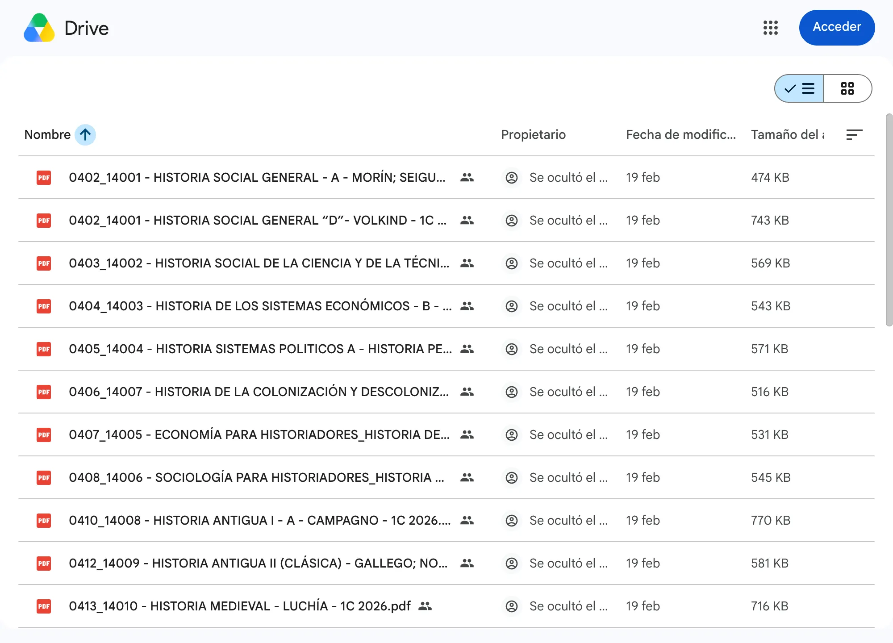
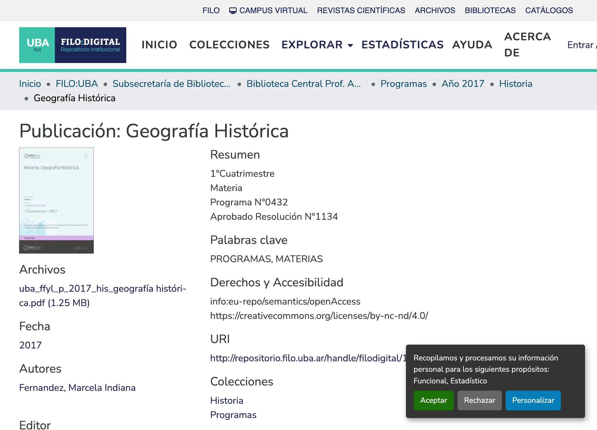
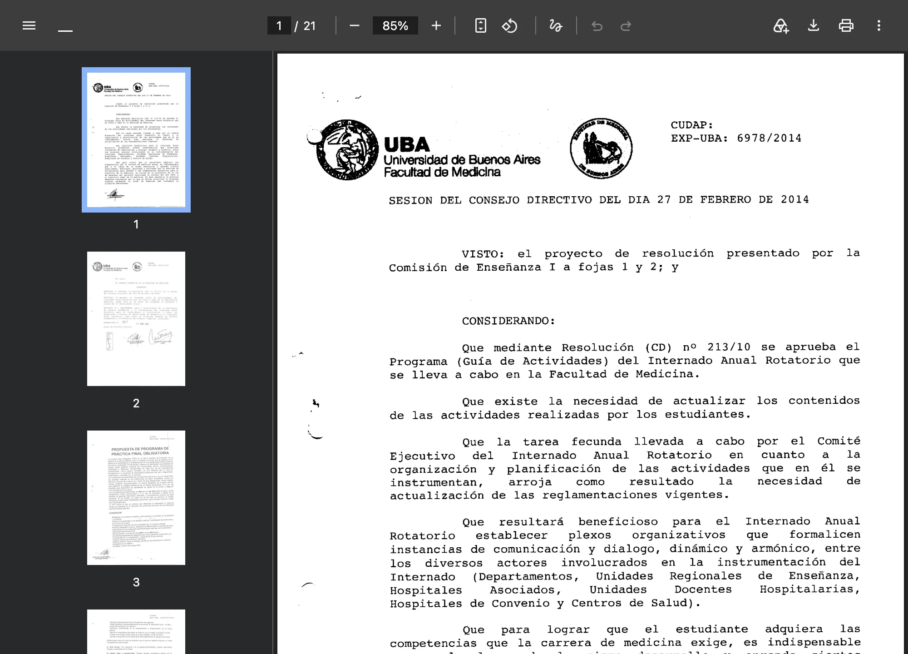
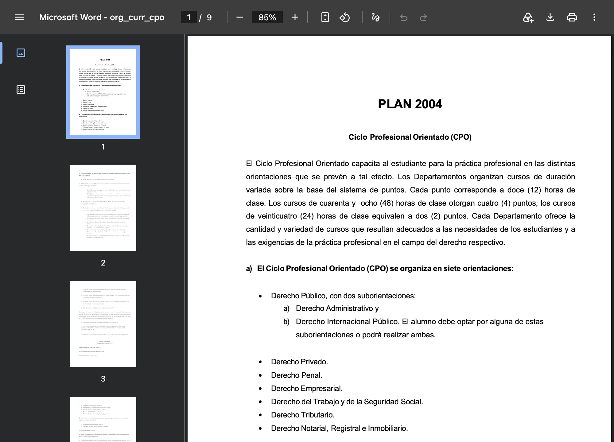
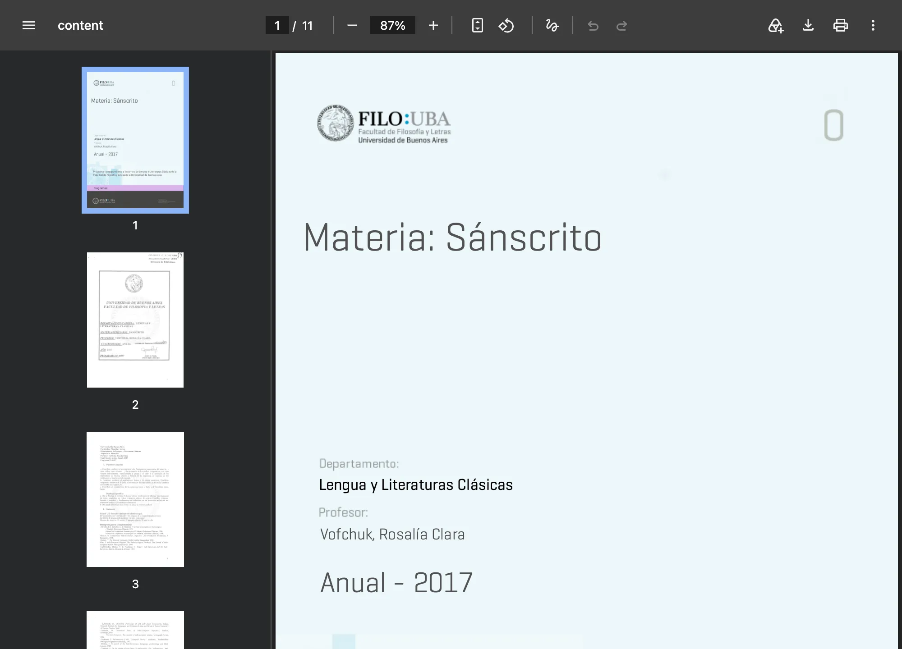
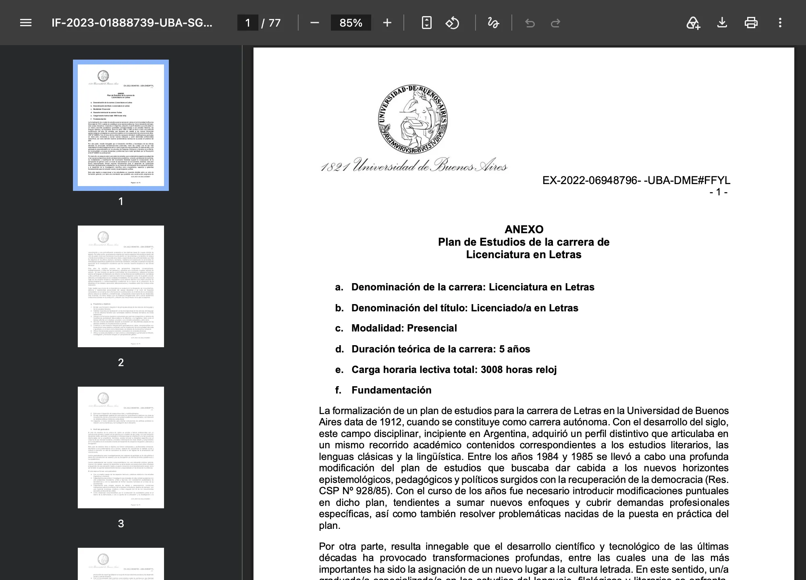
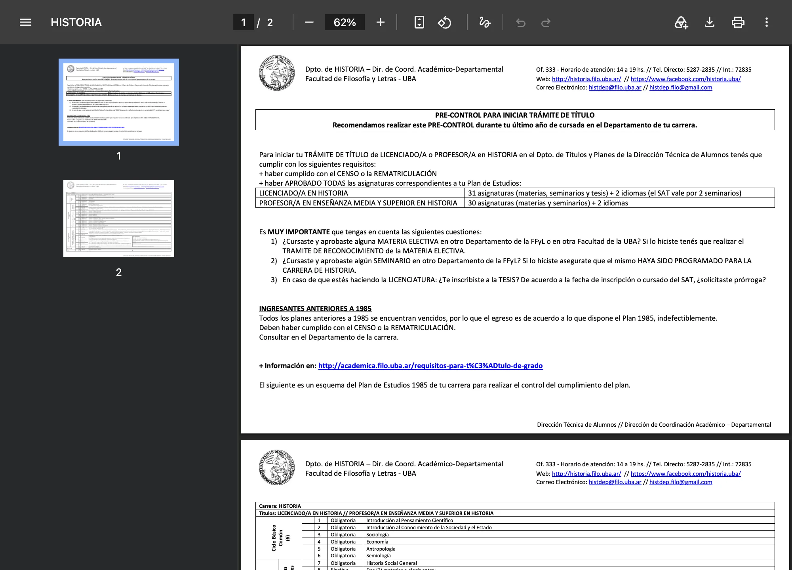

# 🔁 UBA Atlas — an agentic loop you can audit

**A multi-agent pipeline that maps the real Universidad de Buenos Aires — and
proves it did not make anything up.**

**Live: [uba-atlas.vercel.app](https://uba-atlas.vercel.app) · 654 nodes ·
8,563 addresses · 365 adversarial verdicts · 0 fabrications shipped**

The hard part is not the scraping. **LLMs invent facts**, and at 8,000+
addresses no person can check them all. So the system checks itself: one agent
writes, a different agent tries to prove it wrong, and a script decides what
ships.

## ⚙️ Flow

```
🌳 uba → career (official plan) → course (cátedra syllabus) → book (leaf)
   no source → sealed node · one wave = one career = one commit
```

The atlas is a tree. It grows one level at a time. Each level has one real
document behind it. Before anything ships, an adversary tries to break it.

| 🔍 hunt | ✍️ write ×N | ⚔️ attack ×N | 🚦 gate | 🚢 ship |
|---|---|---|---|---|
| <sub>research the real sources for the wave, then fan out.</sub> | <sub>one agent per course. It writes only what the document says.</sub> | <sub>one agent per node. It downloads the document again and checks every claim.</sub> | <sub>a small script. If it fails, nothing ships.</sub> | <sub>the node and its audit, in one commit.</sub> |

Step by step:

| | |
|---|---|
| **📄&nbsp;The&nbsp;node** | a JSON file: title, lede, the document's topics, a source URL |
| **✍️&nbsp;The&nbsp;researcher** | one agent, one course. It writes only what the document says |
| **⚔️&nbsp;The&nbsp;verifier** | downloads the document again and checks every claim. Zero hits → `fabrication` |
| **📌&nbsp;The&nbsp;verdict** | saved before the fix. It never changes |
| **🔧&nbsp;The&nbsp;fix** | deletes what the verdict names. Nothing else |
| **🚦&nbsp;The&nbsp;gate** | a script checks the graph's shape. Red = nothing ships |
| **📦&nbsp;The&nbsp;commit** | node + verdict together. The diff is the proof |

> **Nodes are files. Errors are sentences with a line number.
> The verdict plus the git diff is the proof.**

## 🌍 The sources

There is no UBA API. Every course publishes its program wherever it wants:

<table>
<tr><td width="170"></td><td><b>📄 Drupal PDF</b><br><sub>file names with <code>[brackets]</code> and broken accents. The agent copies the URL byte for byte.</sub></td></tr>
<tr><td width="170"></td><td><b>📁 Google Drive folder</b><br><sub>the current programs live here, and the site's search cannot find them. The agent reads the folder itself.</sub></td></tr>
<tr><td width="170"></td><td><b>🏛️ Academic repository</b><br><sub>DSpace, with an API. The agent checks each download against the repository's own MD5.</sub></td></tr>
<tr><td width="170"></td><td><b>🖨️ Stamped 2014 scan</b><br><sub>the text layer is corrupt. The agent detects it and uses OCR.</sub></td></tr>
<tr><td width="170"></td><td><b>🌐 Webpage only</b><br><sub>no PDF exists. The agent saves a text snapshot and records the method.</sub></td></tr>
<tr><td width="170"></td><td><b>⚖️ Course grid (Derecho)</b><br><sub>1,281 course sections. The adversary wrote a small parser and re-counted all of them.</sub></td></tr>
<tr><td width="170"></td><td><b>🕰️ Degraded 2017 scan</b><br><sub>the newest program that exists. Used, with its year shown on the node.</sub></td></tr>
<tr><td width="170"></td><td><b>📜 76-page resolution</b><br><sub>it holds one table. The agent extracts 7 pages and cites the rest.</sub></td></tr>
<tr><td width="170"></td><td><b>🗺️ The official plan</b><br><sub>the real list of courses. The tree starts here.</sub></td></tr>
</table>

No per-site scrapers. Each agent has a terminal (`curl`, `pdftotext`,
`tesseract`) and solves its source on the spot.

## 🧩 The skill

One skill, written in markdown. Four role docs next to it:

```
.claude/skills/atlas/
├── SKILL.md         ← the mental model + role router
├── wave.md    🌊    ← expand one career, close it as one commit
├── grounding.md ✍️  ← research one course; write only what the document says
├── verify.md  ⚔️    ← attack one node; try to prove it wrong
└── ops.md     📊    ← what is missing · queries · deploy
```

Open the repo in **Claude Code** and say *"expandí Edición"*. The session
loads the skill, shows the plan and the cost, and waits for an OK. Each agent
prints its role when it starts (🌊 ✍️ ⚔️ 📊).

## 📊 Scale

| | |
|---|---|
| faculties | **13 / 13** — every career, ~2,640 courses, all from official sources |
| Medicina | **43 / 44** — includes the 6 hospital rotations. The last course publishes no program, and its node says so |
| Letras | **62 / 62 — complete** — five waves |
| Historia | **21 / 38** — the full core cycle; ~3,700 bibliography entries counted |
| Computación | **18 / 20** courses + all **90 unit nodes** and 1 book node. The other 2 publish no syllabus, and their nodes say so |
| Abogacía | **14 / 14** CPC courses + 81 unit nodes, plus the **8 CPO orientations** straight from the texto ordenado |
| Filosofía | **11 / 11** required courses + 60 unit nodes. Languages, seminars and thesis are a gate on the plan, not drawn yet |
| verified | **198 / 199** course nodes carry an adversarial verdict. The one without is Medicina's Bioinformática, drawn at L1 because it publishes no program |
| fabrications shipped | **0** |

## 🎯 Catches

| wave | caught by the adversary |
|---|---|
| Medicina | a node said **"siete"** blocks. The source has 4 |
| Lingüística | an **invented resolution number**. The PDF prints a different one |
| Clásicas | a rule said the drawn volume was "the only one". The adversary found 6 more |
| Letras w4 | **the loop refuted its own orchestrator**: a node sealed as "no program exists" — the adversary found 3 |
| re-verify | a sweep over every pre-loop node: **13 fabrications** — one was a student repo passed off as an official program |
| Letras w5 | the node's own list of source contradictions **invented one of them** |
| Abogacía | all 8 orientation nodes verified by **re-counting 638 codes and 1,281 sections** from the raw grid |
| Historia | **the loop refuted its own scout, twice**: a "newest that exists" 2017 program lost to the 2026 one, hiding in a Drive folder |
| Historia | five nodes quoted a pdftotext artifact as "literal" text. **Five adversaries caught it independently** |
| Computación | the whole subtree — **111 nodes, unit level** — verified in one wave; 3 fabrications caught |
| Medicina | the last unverified course drew **8 of 11 units and 8 of 11 books** and called it "verbatim". The adversary re-parsed the scan and found the three of each it dropped |

Every verdict is committed in `verification/`, one file per node. The live
site shows them: every node has its audit panel, and
[/audit.html](https://uba-atlas.vercel.app/audit.html) lists all 365.

## 🛠️ Run it

```bash
node serve.js &          # local navigator + graph on :4137
node build-site.js       # render nodes/ + verification/ → site/
node check-graph.js      # the gate
```

The deploy is only the artifact: static JSON, rendered. No endpoints. No
online generation.

---

MIT · Deep docs: `CONCEPT.md` · `PROJECT.md` · `PILOT-FINDINGS.md` · `SOURCE-MAP.md`
