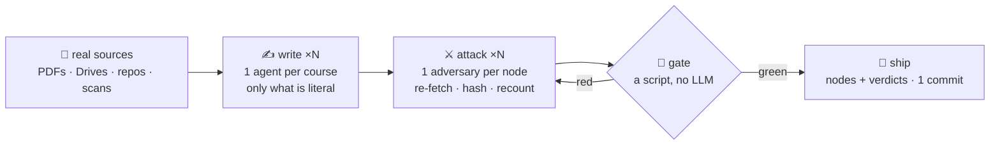

# 🔁 UBA Atlas — an agentic loop you can audit

**A multi-agent pipeline that researches the real Universidad de Buenos Aires,
writes a knowledge graph, and — the hard part — proves it didn't make anything up.**

**Live: [uba-atlas.vercel.app](https://uba-atlas.vercel.app) · 654 nodes ·
8,560 addresses · 364 adversarial verdicts · 0 fabrications shipped**

The interesting problem is not scraping a university. It is that **LLMs
fabricate**, and at 8,000+ addresses no human can check them. The answer here
is not a better prompt — it is a topology: generation and audit never share
context, and a script without an LLM gates every commit.

## 🧠 The mental model

The atlas is a tree. It grows one level at a time, and each level has one
source of truth:

```
UBA → career (L1: the official plan) → course (L2: the cátedra's syllabus) → book (L3: leaf)

to index ──research──▶ to create ──generate──▶ created
```

- 🌱 **Expansion** — research pushes the frontier down one level.
- ⚔️ **Verification** — an adversary attacks every new leaf before it ships.
- 🕳️ **No source?** — the node is sealed, honestly. The gap is information.
- 📦 **One wave** = one career = one commit = one revert point.

## ⚙️ The loop



Writers and adversaries **never share context**. The adversary does not review
the writer's work — it re-downloads the document, re-extracts it, re-counts
everything itself, and the two independent derivations must agree.
Disagreements become a committed verdict file, refuted claim by refuted claim.

## 🔬 The life of one fabrication (real case)

Course: *Paradigmas de Programación*. The whole system, on one node:

1. 📄 A node is a JSON file — title, lede, the source's topics in the source's words, a `source` URL.
2. ✍️ The researcher, making it read nicely, glossed the logic paradigm as *«la computación expresada como relaciones y deducción»*. The plan never says that. It says **«lógico»**.
3. ⚔️ The verifier starts empty, re-downloads the PDF, checks the hash, greps every claim. Zero hits. Verdict: `fabrication`, with the sentence, the line where it should have been, and the repair: *delete the gloss, keep the source's word*.
4. 📌 The verdict is persisted to `verification/` **before** any fix — it records the pre-fix state, and is never edited again.
5. 🔧 A fix agent edits only what `not_found[]` enumerates, re-reading the cited line before each repair — it cannot invent while fixing.
6. 🚦 `check-graph.js` validates structure (a legal, addressable tree; every non-sealed node cites a source). It cannot judge truth — only shape. **The LLM never has the last word on what enters the repo; this script does.**
7. 📦 One commit carries the fixed node **and** its verdict: the verdict says what was wrong, the git diff shows what changed because of it. [/audit.html](https://uba-atlas.vercel.app/audit.html) renders all of it.
8. ⚖️ And when the verifier itself is wrong (it happens), the fixer checks the ground text and reports the deviation. **Evidence beats any agent — verifier included.**

## 🎯 What the loop catches (real, from the logs)

| wave | caught by adversarial verification |
|---|---|
| Medicina | a node describing **"siete"** práctico blocks — the source has 4. Pure prose fabrication, refuted line-by-line |
| Lingüística | a **fabricated resolution number** (Res. 2503/2019) — the PDF itself prints 2523/15 |
| Clásicas w3 | a selection rule claiming a drawn volume was "the only one" — the verifier found 6 more qualifying volumes |
| Letras w4 | **the loop refuted its own orchestrator**: a node sealed as "no programa exists" was overturned by an absence-verifier that found 3 real programas |
| Full re-verify | retroactive sweep over every pre-loop node: **13 fabrications caught** — a student repo passed off as a cátedra programa, an apunte authored from instructor names, a chronologically impossible correlativa — every one re-grounded or removed |
| Letras w5 | a **contradictions register that itself fabricated**: the node's ledger of in-PDF contradictions invented one mention and inverted another |
| Abogacía CPO | all 8 orientation nodes verified by **reproducing every snapshot count exactly** (638 course codes, 1,281 comisiones re-counted from the raw grid) |
| Historia w1 | **the loop refuted its own scout — twice**: a "newest that exists" 2017 programa fell to the current 2026 one, hiding in a Drive folder the career site's search never indexes |
| Historia w1 | a whole **class of false divergences unmasked**: five nodes quoted "literal" cover text containing a pdftotext de-hyphenation artifact — every verifier re-extracted and proved the covers identical |
| Computación | the whole subtree (**111 nodes, unit level included**) adversarially verified in one wave; 3 fabrications caught, incl. a gloss the plan never printed |

Every verdict is committed in `verification/` — line-referenced refutation
reports, one per node — and `extract/manifest.json` records each source's URL
and extraction method. The audit trail ships with the artifact: every verified
node on the live site carries its *Verificación adversarial* panel.

## 🌍 The ground is chaos (that's why agents, not scrapers)

There is no "UBA API". There are:

| the source is… | the agent… |
|---|---|
| a Drupal PDF with literal `[brackets]` and NFD accents that 404 when normalized | `curl -g`, URL byte for byte |
| a Google Drive folder the career site's search doesn't index | greps the folder HTML for file ids |
| a DSpace institutional repository | hits the REST API, verifies against the repo's own MD5 |
| a stamped 2014 scan with a corrupt text layer | detects it and falls back to OCR |
| a page that only exists as HTML | snapshots it, method `html` in the manifest |
| a 76-page resolution holding one table | extracts pages 70-76, cites the rest |

Zero per-site connectors were written. Each agent has a terminal (`curl`,
`pdftotext`, `tesseract`, throwaway parsers) and solves its source on the spot.

## 🧩 The operator ships with the repo

One skill, plain markdown, four role docs:

```
.claude/skills/atlas/
├── SKILL.md         ← the mental model above + role router
├── wave.md    🌊    ← expand a career: launch everything, close as 1 commit
├── grounding.md ✍️  ← research one course: only what's literal, all counted
├── verify.md  ⚔️    ← attack one node: refute, don't review
└── ops.md     📊    ← coverage · queries · build & deploy
```

Open the repo in **Claude Code** and say *"expandí Edición"* — the session
routes to the skill, shows the plan and the cost, and waits for your OK.
Every agent announces its role on start (🌊 ✍️ ⚔️ 📊): a wave's transcript
reads like a cast list.

## 📊 Scale so far

| | |
|---|---|
| faculties at L1 | **13 / 13** — every career, ~2,640 courses verified against official sources |
| Medicina at L2 | **43 / 44** — incl. the 6 rotations of the Internado Anual Rotatorio (the 44th is honestly L1: no program is published) |
| Letras at L2 | **62 / 62 — complete** — five research+verify waves |
| Historia at L2 | **21 / 38** — the whole Ciclo de Grado; ~3,700 bibliography entries counted both ways |
| Computación at L2 | **18 / 20** courses + all **91 unit nodes** verified; PSE and Tesis honestly L1 |
| Abogacía indexed | CPC + all **8 CPO orientation nodes**, literal from the texto ordenado |
| L2 courses verified | **100%** — every course node carries an adversarial verdict |
| fabrications shipped | **0** |

## 🛠️ Run it

```bash
node serve.js &          # local navigator + graph on :4137
node build-site.js       # render nodes/ + verification/ → site/ (the whole deploy)
node check-graph.js      # the gate
```

The deploy is **only the artifact**: static JSON, rendered. No endpoints, no
online generation.

---

MIT · Deep docs: `CONCEPT.md` · `PROJECT.md` · `PILOT-FINDINGS.md` · `PLAN-SCRAPEO.md`
