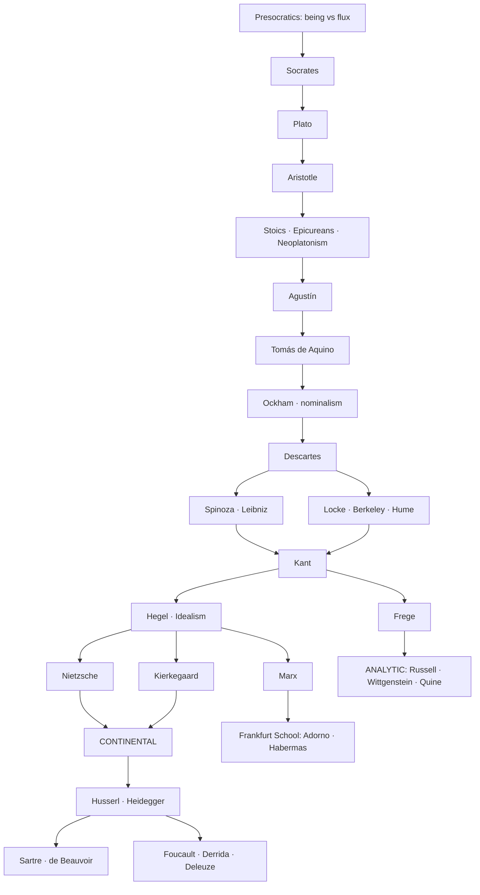

# Western Philosophy — the 10-hour map
### distilled from UBA · Facultad de Filosofía y Letras · Licenciatura en Filosofía (Plan 2017)

> **What this is.** The `README.md` of a philosophy degree. Not the degree.
> A 5-year *plan de estudios* is the high-resolution ground truth — direction,
> sequence, dependencies that experts tuned for decades. This file renders that
> same direction at a *lower altitude*: the shape of the field, the questions
> each era asked, the names you must know, and how they connect. Zoomed out like
> a country-level map — cities, not streets.

## The scope contract (read this first — it's the honest part)

**Budget: ~10 hours. Goal: understand how philosophers think, without becoming one.**

Ten hours buys you the **map, the vocabulary, and the moves** — enough to read a
philosophy argument and know what tradition it's in, what it's reacting against,
and what question it thinks it's answering. It does **not** buy competence: that
lives in the primary texts and the reps (writing the arguments, defending them),
which is what the actual 5-year program is *for*. This is the difference between
reading an architecture README (10 h) and being able to maintain the codebase
(years). Both are real; they're different claims. Don't confuse having this map
with having walked the territory.

| Zoom level | Time | What you get |
|---|---|---|
| **this file** | ~1 h read | orientation: the tree, the throughline, who's who |
| + the itinerary below | ~10 h | how each tradition *thinks* — the moves, not just the names |
| one "Historia" course | ~1 semester | one era's primary texts, argued |
| the full Licenciatura | 5 years | competence — you can *do* philosophy |

---

## The ground truth this is distilled from (the "codebase")

UBA organizes the degree on **two axes at once** — and that duality *is* the
subject's structure, worth seeing before the tree:

1. **The historical spine** (direction over time) — four obligatory courses,
   each paired with a deeper "Problemas" course:
   `Historia de la Filosofía Antigua → Medieval → Moderna → Contemporánea`
2. **The systematic problems** (cross-cutting, timeless questions) — taken
   alongside the history: `Lógica · Gnoseología (knowledge) · Metafísica /
   Ontología (being) · Ética (right action) · Estética (art/beauty) ·
   Antropología Filosófica (what is a human) · Filosofía de las Ciencias`
3. Plus the gate most people don't expect: **three levels each of two languages**
   — one Latin (francés/italiano/portugués), one Saxon (inglés/alemán) — because
   the texts don't survive translation intact. That requirement tells you
   something: philosophy is *close reading*, not summary.

Read the spine top-to-bottom for the story; read the systematic problems as the
columns every era fills in differently.

---

## The tree — Western philosophy, directional

Read top→bottom as time; each era is defined by **the question it couldn't stop
asking** and **who it was arguing against**. `⇒` = "reacts against / answers".

```
WESTERN PHILOSOPHY
│
├─ ANTIGUA  ······················· UBA: Hª Filosofía Antigua
│   │  Q: "What is everything really made of, and can we know it?"
│   │
│   ├─ Presocratics ............... Thales, Heráclito (flux), Parménides (being)
│   │      ⇒ first move: swap myth for physis (nature) as explanation
│   ├─ Sophists / Sócrates ........ Protágoras vs Sócrates ("know thyself", the elenchus)
│   ├─ PLATO ..................... Forms; the world is a shadow of the real
│   ├─ ARISTOTLE ................. ⇒ Plato: no — form is *in* the thing; logic, causes, virtue
│   └─ Hellenistic + late ........ Stoics · Epicureans · Scepticism · Plotino (Neoplatonism)
│          Q shifts: "How do I live well in a world I can't control?"
│
├─ MEDIEVAL  ······················ UBA: Hª Filosofía Medieval
│   │  Q: "Can faith and reason be the same truth?"
│   ├─ Agustín ................... inwardness, will, time (Antigua ⇒ Christianity)
│   ├─ Islamic + Jewish bridge ... Avicena, Averroes, Maimónides (kept Aristotle alive)
│   ├─ TOMÁS DE AQUINO .......... the great synthesis: Aristotle + Christian doctrine
│   └─ Scotus · Ockham .......... ⇒ Aquinas: pull them apart again (nominalism, the razor)
│
├─ MODERNA  ······················· UBA: Hª Filosofía Moderna
│   │  Q: "Forget authority — what can *I*, alone, actually know for certain?"
│   ├─ Rationalists ............. DESCARTES (cogito) · Spinoza · Leibniz — reason is the source
│   ├─ Empiricists .............. Locke · Berkeley · HUME — no, the senses are (⇒ rationalists)
│   ├─ KANT ..................... ⇒ both: the mind *shapes* experience; the hinge of the whole tree
│   └─ German Idealism .......... Fichte · Schelling · HEGEL (history as reason unfolding)
│
└─ CONTEMPORÁNEA  ················· UBA: Hª Filosofía Contemporánea + Corrientes
    │  Q: "Was the whole project (reason, the subject, truth) a mistake?"
    │
    ├─ The hammer-swingers ...... MARX (economics) · Kierkegaard (faith) · NIETZSCHE (power)
    │        ⇒ Hegel/Enlightenment: all three detonate "reason marches forward"
    │
    ├─ ANALYTIC branch .......... Frege → Russell → WITTGENSTEIN → Vienna Circle → Quine, Kripke, Rawls
    │        move: philosophy = clarifying language & logic. Dominant in English-speaking world.
    │
    └─ CONTINENTAL branch ....... the other river; UBA leans here
         ├─ Phenomenology ....... HUSSERL → HEIDEGGER (back to lived experience, "being")
         ├─ Existentialism ...... SARTRE, Merleau-Ponty, de Beauvoir (freedom, the body)
         ├─ Hermeneutics ........ Gadamer (understanding as interpretation)
         ├─ Critical Theory ..... Adorno, Benjamin, HABERMAS (Frankfurt School; ⇒ Marx)
         └─ Post-structuralism .. FOUCAULT (power/knowledge) · Deleuze · DERRIDA (deconstruction)
```

**The single throughline, in one breath:** *what is real* (Antigua) → *can faith
and reason agree* (Medieval) → *what can I know alone* (Moderna) → *was reason
itself the illusion* (Contemporánea). Everything else is detail hanging off those
four turns.

**The one fork to never forget:** after Nietzsche the river splits into
**analytic** (clarify language, ally with logic & science) and **continental**
(interpret experience, history, power). Most confusion about "modern philosophy"
is really confusion about which bank of that river someone is standing on.

---

## The same thing as a lineage graph (mermaid)



---

## The 10-hour itinerary (map → *how they think*)

Not "read the classics" — that's the 5-year path. This is the guided flyover.

1. **h1 — this file.** Memorize the four eras + their four questions + the
   analytic/continental fork. That scaffold makes everything else stick.
2. **h2–3 — Antigua.** One good lecture on Plato's cave + Aristotle's four
   causes. The move to internalize: *Socratic method* — knowledge by relentless
   question, not assertion. (This is literally how a philosopher argues.)
3. **h4 — Medieval, light.** Just the shape: reason imported, married to faith
   (Aquinas), then divorced (Ockham). You need the bridge, not the details.
4. **h5–6 — Moderna, the spine's spine.** Descartes' doubt → Hume's problem
   (you never *see* causation, only sequence) → **Kant's answer** (the mind
   supplies structure). If you deeply get *one* transition in all of philosophy,
   make it Hume→Kant.
5. **h7 — the hammer-swingers.** Marx, Nietzsche, Kierkegaard as three ways of
   saying "the confident Enlightenment story is a lie." This is where *modern*
   thought actually begins.
6. **h8 — the fork.** One overview each of analytic (Wittgenstein: philosophy as
   language-clarification) vs continental (Heidegger: philosophy as recovering
   lived being). Now you can place almost any living philosopher.
7. **h9 — the systematic columns.** Skim the seven problem-areas (ethics,
   knowledge, being, logic, aesthetics, mind, science) — the *questions*, not
   the answers. This is the other UBA axis.
8. **h10 — read one short primary text** end to end (suggest: a Platonic dialogue
   like *Euthyphro*, or Nietzsche's *Genealogy* preface). One real text beats ten
   summaries for feeling *how the moves actually land*.

**Exit test (how you know 10h worked):** you can hear a claim like "the subject is
a construction of power relations," place it (continental, post-structuralist,
Foucault-lineage), name what it argues against (the Cartesian self), and say which
UBA course would teach it (Hª Contemporánea). That's the map working.

---

## Drilling back down (the traceability the whole idea rests on)

Every node here is a fold of the real plan. To zoom *in* on any branch, replace
this file with the actual UBA source — the direction is preserved, the resolution
increases:

- **The map (this file)** → 10 h
- **UBA *esquema de plan* / course list** → the real ordering & correlativ`­idades`
- **A course's *programa*** (e.g. Hª Filosofía Moderna) → unit-by-unit topics + real bibliography
- **The primary texts in that bibliography** → the territory itself

Sources for the ground truth:
[Plan de Estudios Filosofía (Secretaría Académica, Filo·UBA)](https://academica.filo.uba.ar/plan-de-estudios-filosof%C3%ADa) ·
[Plan Licenciatura Filosofía 2017/2024 (PDF)](https://filo.uba.ar/sites/default/files/2024-12/PE%20Licenciatura%20Filosof%C3%ADa%20(modificaci%C3%B3n)%202024.pdf) ·
[Depto. de Filosofía, FFyL·UBA](https://filosofia.filo.uba.ar/)

---
*Proof-of-concept: a real plan de estudios, rendered at a chosen altitude,
directional and traceable. Point the same method at any UBA carrera.*
